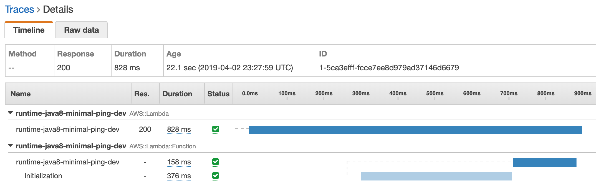
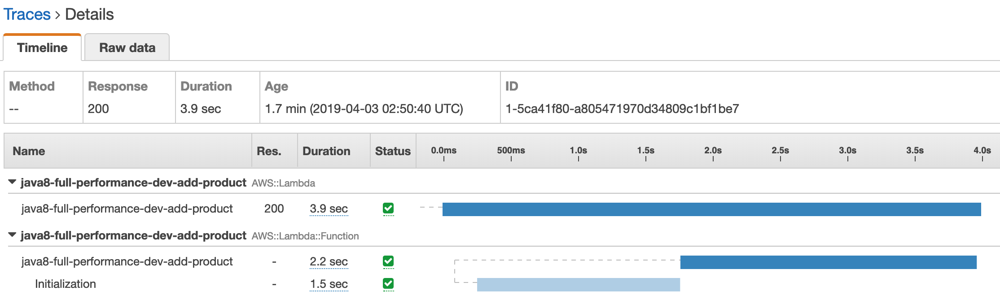

# AWS Lambda - Coldstart comparison

## Java 8 - minimal - 1024 MB


**_CloudWatch_**
```
REPORT Duration: 155.22 ms  Billed Duration: 200 ms  Memory Size: 1024 MB	Max Memory Used: 88 MB
```

## Java 8 - full - 1024 MB



- AWS SDK 2: DynamoDB
- AWS SDK 2: url-connection-client (faster starting HTTP client)
- Gson

**_CloudWatch_**

```
REPORT Duration: 2170.02 ms  Billed Duration: 2200 ms  Memory Size: 1024 MB	Max Memory Used: 158 MB	
```

