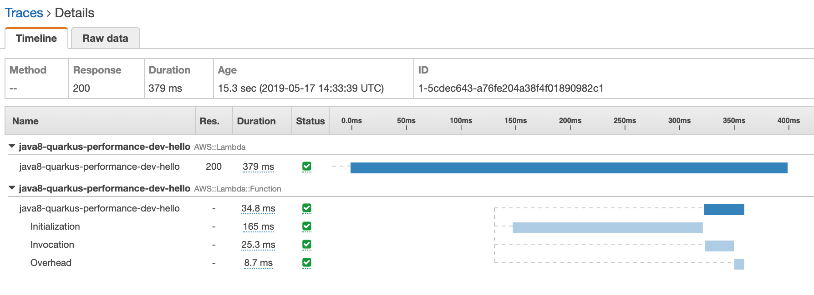
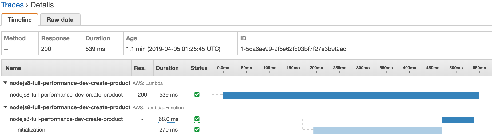

# AWS Lambda - Coldstart comparison

MINIMAL = No external integrations  
FULL = Integration w/ DynamoDB

MINIMAL:
- Java8 - Dagger+Gson: **828 ms**
- Java8 - Quarkus - GraalVM: **379 ms**

FULL:
- nodejs - Middy: **540 ms**
- Java8 - Dagger+Gson: **3.9 sec**
- Java8 - Micronaut: **5.3 sec**

Below you can see the X-Ray for each example.  
**Initialization (light blue)**: This is code initialization (Static blocks + Constructor)  
**After initialization (dark blue)**: This is the function handler code

MINIMAL
------
### Java 8 - minimal - 1024 MB


**_CloudWatch_**
```
REPORT Duration: 155.22 ms  Billed Duration: 200 ms  Memory Size: 1024 MB  Max Memory Used: 88 MB
```

### Java 8 - Quarkus - GraalVM  - 1024 MB

- Quarkus 0.15.0



**_CloudWatch_**
```
REPORT RequestId: 1d453c66-7719-4ac2-bfe8-f17fc029a581	Init Duration: 167.87 ms	Duration: 35.08 ms	Billed Duration: 300 ms Memory Size: 1024 MB	Max Memory Used: 62 MB	
```
**NOTE:** No DynamoDB support yet: https://github.com/quarkusio/quarkus/pull/2193


FULL
-----

### Java 8 - full - 1024 MB


- Dagger
- Gson
- AWS SDK 2: DynamoDB
- AWS SDK 2: url-connection-client (faster starting HTTP client)

**_CloudWatch_**
```
REPORT Duration: 2170.02 ms  Billed Duration: 2200 ms  Memory Size: 1024 MB  Max Memory Used: 158 MB	
```

### Java 8 - Micronaut  - 1024 MB

- Micronaut 1.1.0 (RC2)
- AWS SDK 2: DynamoDB
- AWS SDK 2: url-connection-client (faster starting HTTP client)


**_CloudWatch_**
```
REPORT Duration: 3210.99 ms  Billed Duration: 3300 ms  Memory Size: 1024 MB  Max Memory Used: 172 MB	
```

### nodejs 8 - full - 1024 MB

- TypeScript
- Webpack
- DynamoDB



**_CloudWatch_**
```
REPORT Duration: 69.36 ms  Billed Duration: 100 ms  Memory Size: 1024 MB  Max Memory Used: 106 MB	
```