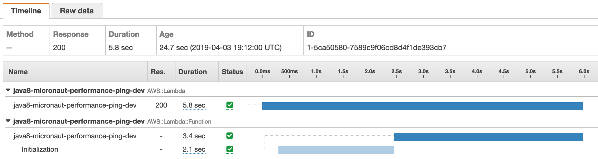

# AWS Lambda - Coldstart comparison

- Java8 minimal: 828 ms
- Java8 full (Dagger+Gson+DynamoDB): 3.9 sec
- Java8 Micronaut (DynamoDB): 5.8 sec

###Java 8 - minimal - 1024 MB


**_CloudWatch_**
```
REPORT Duration: 155.22 ms	Billed Duration: 200 ms Memory Size: 1024 MB	Max Memory Used: 88 MB**
```

###Java 8 - full - 1024 MB


- Dagger
- Gson
- AWS SDK 2: DynamoDB
- AWS SDK 2: url-connection-client (faster starting HTTP client)

**_CloudWatch_**

```
REPORT Duration: 2170.02 ms	Billed Duration: 2200 ms Memory Size: 1024 MB	Max Memory Used: 158 MB	
```

###Java 8 - Micronaut  - 1024 MB

- Micronaut 1.1.0 (RC2)
- AWS SDK 2: DynamoDB
- AWS SDK 2: url-connection-client (faster starting HTTP client)



```
REPORT Duration: 3399.12 ms  Billed Duration: 3400 ms  Memory Size: 1024 MB  Max Memory Used: 175 MB	
```